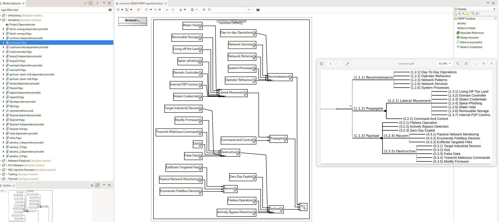

# Security Model Converter (SMC)

SMC is an Open-Source command-line application written in GoLang that converts security model data to different formats. SMC supports conversion between SAND Attack Trees, Dependency Models, and FRIPP (see supported formats below). SMC is designed to work alongside the [Security Modelling Framework (SecMoF)](https://github.com/CardiffUniCOMSC/SecMoF) tool. 

SMC uses GraphML as an intermediate format to allow conversion of the different formats, since GraphML is a widely used format it may be used to import/export the models into other tools, including and beyond SecMoF. 

**Install**

[Golang](https://go.dev/learn/) is required to compile and run this tool. Final versions will have release binaries.

    go install github.com/PMaynard/smc@latest

**Usage**

The tool converts models between each other using GraphML as a common format. 
```bash
smc [fripp|dm|idm|sand] in.fripp out.graphml
```

Convert a SAND Attack Tree into SecMoF FRIP Playbook:

```bash
smc sand testdata/sand/example.ctrees example.fripp
```

Convert FRIP Playbook to GraphML
```bash
smc fripp testdata/fripp/example.fripp example.graphml
```


**Supported Formats (IN|OUT)** 

| Format      | CTree   | GraphML  | SecMoF   | iDepend |
| --------------: | :-----: | :------: | :------: | :-----: |
| SAND Attack Trees | Y\|**N** | Y\|Y | -\|- | -\|-     |
| Dependency Model | -\|-    | Y\|Y | Y\|Y | Y\|**N** |
| Playbook Process | -\|-| Y\|Y | Y\|Y | -\|-    |

**Non-Goals**

* Output SAND Attack Trees.
* Output iDepend XML models.
* Replace the Eclipse based Security Modelling Framework Tool (SecMoF).

**Example**

The below file is a textual representation of SAND Attack Trees using tabs to indicate a child node of the above line. 

By running: `smc sand data/ctrees/common.ctrees common.fripp` the Attack Tree is converted into a XML file that can be read by [SecMoF](https://github.com/CardiffUniCOMSC/SecMoF) then formally verified using the tool. 

***File**: data/ctrees/common.ctrees*

    *
        Reconnaissance 
            Day-to-day Operations
            Operator Behaviour 
            Network Patterns
            Network Services
            System Processes
        Propagate : SAND
            Lateral Movement
                Living off the Land
                Domain Controller
                Stolen Credentials
                Spear-phishing
                Water Hole
                Removable Storage
                Internal P2P Comms.
            Command and Control
        Payload : SAND
            Fileless Operation
            Actively Bypass Detection
            Zero Day Exploit
            Reconn
                Passive Network Monitoring
                Enumerate Fieldbus Devices
                Exfiltrate Targeted Files
            Destructive
                Target Industrial Devices
                DoS
                False Data
                Transmit Malicious Commands 
                Modify Firmware




***Figure 1**:* *Common SAND Attack Tree loaded into SecMof after being converted, with the original Attack Tree on the right.* 

## Development
### Testing

View test coverage. Currently have 85% of the statements covered by tests. 

The primary focus has been on the SAND Attack Tree to SecMoF Playbook Process format, the other code paths were secondary.

    go test -coverprofile=coverage.out
    go tool cover -html=coverage.out

## Models License

The Models, Playbooks, and SAND Attack Trees are licensed under [CC BY-SA 4.0](http://creativecommons.org/licenses/by-sa/4.0).

## Code License

Copyright (c) 2023 Peter Maynard

Permission is hereby granted, free of charge, to any person obtaining a copy of this software and associated documentation files (the "Software"), to deal in the Software without restriction, including without limitation the rights to use, copy, modify, merge, publish, distribute, sublicense, and/or sell copies of the Software, and to permit persons to whom the Software is furnished to do so, subject to the following conditions:

The above copyright notice and this permission notice shall be included in all copies or substantial portions of the Software.

THE SOFTWARE IS PROVIDED "AS IS", WITHOUT WARRANTY OF ANY KIND, EXPRESS OR IMPLIED, INCLUDING BUT NOT LIMITED TO THE WARRANTIES OF MERCHANTABILITY, FITNESS FOR A PARTICULAR PURPOSE AND NONINFRINGEMENT. IN NO EVENT SHALL THE AUTHORS OR COPYRIGHT HOLDERS BE LIABLE FOR ANY CLAIM, DAMAGES OR OTHER LIABILITY, WHETHER IN AN ACTION OF CONTRACT, TORT OR OTHERWISE, ARISING FROM, OUT OF OR IN CONNECTION WITH THE SOFTWARE OR THE USE OR OTHER DEALINGS IN THE SOFTWARE./

